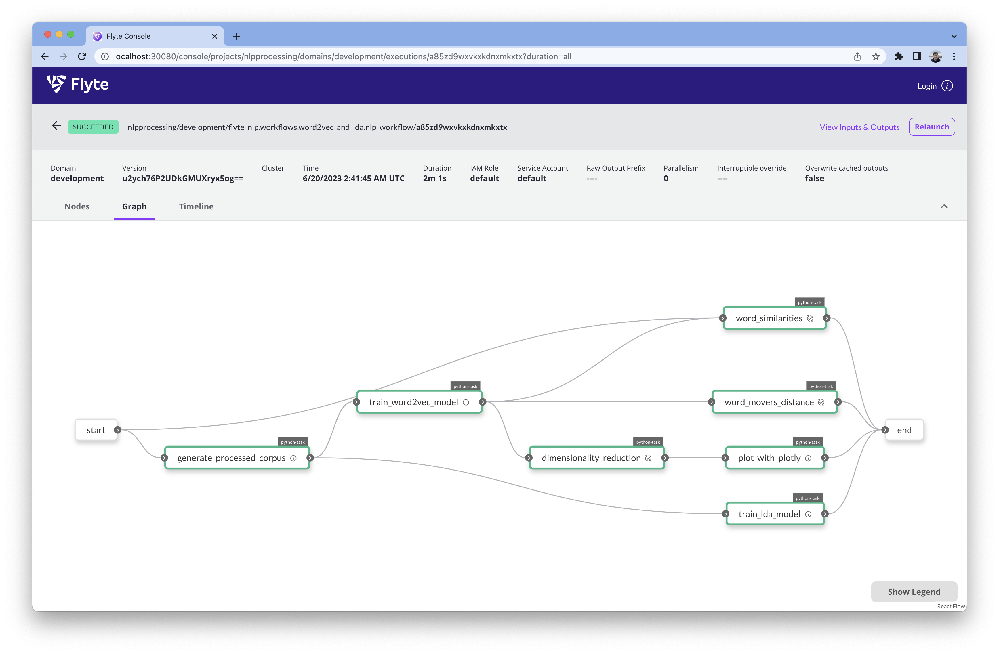

# flyte-nlp

An example of an NLP use case deployed and run inside Flyte Sandbox. It follows the Flyte's official [tutorial](https://docs.flyte.org/projects/cookbook/en/latest/auto/case_studies/ml_training/nlp_processing/index.html)

## Setup
To setup a sandbox environment, make sure to have `flytectl` installed. To spin up the sandbox cluster, run `make setup`.

Then register a new project with 
```bash
flytectl create project --id nlpprocessing --name "NLP Processing" --description "NLP Processing Use case"
```

## Docker
To build the docker image for this example and push it to the sandbox's registry, run `make docker`

## Register the package
To register the code of the use case, run `make register`, you should see an output similar to this
```
Successfully serialized 9 flyte objects
[✔] Registration flyte_nlp.workflows.word2vec_and_lda.generate_processed_corpus type TASK successful with version u2ych76P2UDkGMUXryx5og==
[✔] Registration flyte_nlp.workflows.word2vec_and_lda.train_word2vec_model type TASK successful with version u2ych76P2UDkGMUXryx5og==
[✔] Registration flyte_nlp.workflows.word2vec_and_lda.train_lda_model type TASK successful with version u2ych76P2UDkGMUXryx5og==
[✔] Registration flyte_nlp.workflows.word2vec_and_lda.word_similarities type TASK successful with version u2ych76P2UDkGMUXryx5og==
[✔] Registration flyte_nlp.workflows.word2vec_and_lda.word_movers_distance type TASK successful with version u2ych76P2UDkGMUXryx5og==
[✔] Registration flyte_nlp.workflows.word2vec_and_lda.dimensionality_reduction type TASK successful with version u2ych76P2UDkGMUXryx5og==
[✔] Registration flyte_nlp.workflows.word2vec_and_lda.plot_with_plotly type TASK successful with version u2ych76P2UDkGMUXryx5og==
[✔] Registration flyte_nlp.workflows.word2vec_and_lda.nlp_workflow type WORKFLOW successful with version u2ych76P2UDkGMUXryx5og==
[✔] Registration flyte_nlp.workflows.word2vec_and_lda.nlp_workflow type LAUNCH_PLAN successful with version u2ych76P2UDkGMUXryx5og==
Successfully registered 9 entities
```

Then head over to the Flyte Console [http://localhost:30080/console/projects/nlpprocessing/workflows](http://localhost:30080/console/projects/nlpprocessing/workflows), and launch the `nlp_workflow`. After the workflow execution is finished, you should see the following results
